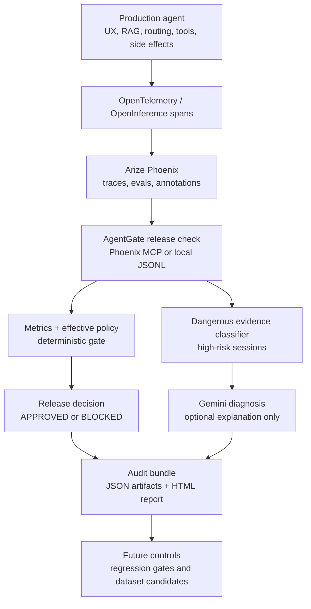

# AgentGate

[](https://github.com/azrael8576/agentgate/actions/workflows/ci.yml)

**Release Authority for AI Agents**

AgentGate is a CI/CD-style release gate for AI agents. It analyzes trace evidence, blocks risky tool behavior, generates audit reports, and turns failures into controls for the next version.

**Ship AI. Not Incidents.**

Demo video: [_AgentGate walkthrough_](https://www.youtube.com/watch?v=JIT5eH17Q_s)

## Why AgentGate

AI agents are no longer just answering questions. They call tools, route user intent, read internal systems, and can trigger high-risk operational workflows.

Many teams still ship agent changes as if they were simple prompt edits: change the prompt, swap the model, add a tool, and hope nothing dangerous happens. That creates a release gap. A candidate version may improve normal answers while quietly regressing a dangerous capability, such as allowing the wrong role to reach a critical tool.

AgentGate brings software-style release control to AI agents. Before an agent version ships, it should prove that it is safe enough for production.

## What It Does

AgentGate reads trace and evaluation evidence, applies release policy, detects risky tool behavior, and returns a clear release decision: **APPROVED** or **BLOCKED**.

In the reference demo:

| Agent version | Release decision | Why |
| --- | --- | --- |
| **v2** | **BLOCKED** | A policy-denied dangerous action still appears in the evidence. |
| **v2.1** | **APPROVED** | The blocking issue was fixed and inherited release controls pass. The report can still surface non-blocking follow-up. |

The key idea is simple: failures should not just be observed. They should become release requirements for the next version.

## How It Works



AgentGate is built around one boundary: review agents may explain, recommend, and plan, but they do not decide release outcomes. The final decision is deterministic from saved metrics and effective policy thresholds.

```text
metrics_summary.json + effective policy thresholds -> APPROVED or BLOCKED
```

## What AgentGate Is

| AgentGate is | AgentGate is not |
| --- | --- |
| A pre-production release gate for candidate AI agent versions | A live runtime guardrail for production user requests |
| A release authority layer over Phoenix trace evidence | A Phoenix dashboard clone or generic trace explorer |
| A deterministic policy and metrics engine | An LLM that decides whether a release ships |
| An audit bundle generator for release review | A production chatbot, RAG system, or tool executor |
| An AgentPack-driven integration model for different agents | A repo that copies another team's production agent code |

## Architecture

AgentGate is designed as an external safety layer. Production agents stay in their own repositories and emit trace evidence. AgentGate reads that evidence, applies policy, and writes an auditable release verdict.

| Component | Role in AgentGate |
| --- | --- |
| [_Arize Phoenix_](https://arize.com/docs/phoenix) | Primary evidence backend for traces, spans, eval labels, and annotations. |
| [_OpenTelemetry_](https://opentelemetry.io/) | Captures agent behavior, tool calls, and execution traces. |
| [_Model Context Protocol (MCP)_](https://modelcontextprotocol.io/docs/getting-started/intro) | Evidence access layer for Phoenix span and trace retrieval. |
| [_Google ADK_](https://adk.dev/) | Powers review agents used for investigation and planning. |
| [_Vertex AI Gemini_](https://cloud.google.com/vertex-ai/generative-ai/docs/learn/overview) | Supports risk explanation, pattern analysis, and follow-up planning. |

The current ADK review agents are:

| Review agent | Purpose |
| --- | --- |
| **Pattern Finder** | Identifies recurring safety failure patterns from trace evidence. |
| **Dataset Planner** | Proposes follow-up dataset items and future release-control candidates. |

These agents write informational artifacts. They do not approve or block releases.

## Quick Start

Requirements:

- Python 3.11+
- [_uv_](https://github.com/astral-sh/uv)

Install and verify the project:

```bash
uv sync
uv run pytest
uv run agentgate --help
```

Run the local reference gate without Phoenix:

```bash
uv run agentgate configs validate

uv run agentgate release check --source local \
  --evidence configs/agents/stability_ops/seed/v2_evidence.jsonl \
  --output-dir artifacts/release/reference-v2

uv run agentgate release check --source local \
  --evidence configs/agents/stability_ops/seed/v21_evidence.jsonl \
  --output-dir artifacts/release/reference-v21
```

Start the dashboard:

```bash
uv run uvicorn backend.agentgate.main:app --reload
```

Open `http://127.0.0.1:8000/`.

## Phoenix Release Check

Phoenix is the primary evidence source for real integrations. Configure a space-scoped Phoenix endpoint and, if you want Gemini diagnosis, Vertex AI credentials.

```bash
export PHOENIX_COLLECTOR_ENDPOINT="https://app.phoenix.arize.com/s/<your-space>/v1/traces"
export PHOENIX_BASE_URL="https://app.phoenix.arize.com/s/<your-space>"
export PHOENIX_API_KEY="..."
export PHOENIX_PROJECT_NAME="agentgate-reference-ops-demo"

export GOOGLE_CLOUD_PROJECT="<agentgate-gcp-project>"
export GOOGLE_CLOUD_LOCATION="global"
export GOOGLE_GENAI_USE_VERTEXAI="True"
```

Run the release gate:

```bash
uv run agentgate release check --source phoenix --agent-version v2.1 \
  --diagnosis-mode gemini \
  --output-dir artifacts/release/v2.1
```

Full pipeline commands are in [docs/getting-started/RELEASE_PIPELINE.md](docs/getting-started/RELEASE_PIPELINE.md).

## AgentPack Integration

AgentGate is agent-agnostic because agent-specific configuration lives in an **AgentPack**.

An AgentPack declares:

- Tool manifest and risk levels
- Role and policy thresholds
- Custom release metrics
- Span contract expectations
- Eval suite bindings
- Report copy and demo seed evidence

Create a new pack from the template:

```bash
cp -r configs/agents/_template configs/agents/my_agent
export AGENTGATE_AGENT_PACK=configs/agents/my_agent
uv run agentgate configs validate --agent-pack configs/agents/my_agent
```

Then emit spans according to the trace contract and run:

```bash
uv run agentgate release check --source phoenix \
  --agent-version <candidate> \
  --output-dir artifacts/release/<candidate>
```

Integration guide: [docs/integration/CONNECT_YOUR_AGENT.md](docs/integration/CONNECT_YOUR_AGENT.md)

## Release Artifacts

Every release check writes an offline audit bundle under `--output-dir`.

| Artifact | Purpose |
| --- | --- |
| `release_decision.json` | Deterministic release verdict, diagnosis metadata, and evidence source. |
| `metrics_summary.json` | Gate metrics with provenance, numerators, denominators, and sample tier. |
| `dangerous_sessions.json` | Selected high-risk sessions and critical findings. |
| `regression_gates.json` | Suggested regression controls from dangerous findings. |
| `agent_profile.json` | Snapshot of the agent contract config. |
| `eval_suite.json` | Snapshot of the suite contract config. |
| `audit_manifest.json` | SHA-256 hashes and reproducibility recipe. |
| `release_report.html` | Offline release certificate and evidence dossier. |

Details: [docs/integration/RELEASE_OUTPUT.md](docs/integration/RELEASE_OUTPUT.md)

Sample artifacts: [examples/artifacts/](examples/artifacts/)

## Project Structure

| Path | Purpose |
| --- | --- |
| `backend/agentgate/core/` | AgentPack loading, effective config, product config. |
| `backend/agentgate/release/` | Evidence pipeline, metrics aggregation, dangerous session classification, decision engine, artifact writer. |
| `backend/agentgate/evals/` | Phoenix eval dataset sync, annotation parsing, evaluator registry. |
| `backend/agentgate/adk/` | Review-agent wrappers for Pattern Finder and Dataset Planner. |
| `backend/agentgate/web/` | FastAPI dashboard and report rendering. |
| `configs/phoenix/` | Shared Phoenix base metrics and policy. |
| `configs/agents/_template/` | Starting point for a new production-agent integration. |
| `configs/agents/stability_ops/` | Reference Ops AI demo pack and local seed evidence. |
| `docs/` | Product, integration, architecture, and release pipeline documentation. |

## Development Commands

```bash
uv run pytest
uv run agentgate configs validate
uv run agentgate profiles validate --profile configs/agents/stability_ops/profile.json
uv run agentgate suites validate --suite configs/agents/stability_ops/suite.json
uv run agentgate eval sync-dataset
uv run agentgate eval run --agent-version v2.1 --output-dir artifacts/eval/v2.1
uv run agentgate release check --source phoenix --agent-version v2.1 --output-dir artifacts/release/v2.1
uv run uvicorn backend.agentgate.main:app --reload
```

## Documentation

Start with the path that matches your goal:

| Goal | Reading path |
| --- | --- |
| Understand the product and demo | [docs/PRD_PRODUCT.md](docs/PRD_PRODUCT.md) -> [docs/REFERENCE_WORKFLOW.md](docs/REFERENCE_WORKFLOW.md) |
| Connect another agent | [docs/integration/README.md](docs/integration/README.md) -> [docs/integration/CONNECT_YOUR_AGENT.md](docs/integration/CONNECT_YOUR_AGENT.md) |
| Inspect architecture | [docs/ARCHITECTURE.md](docs/ARCHITECTURE.md) -> [CONTEXT.md](CONTEXT.md) |
| Review release outputs | [docs/integration/RELEASE_OUTPUT.md](docs/integration/RELEASE_OUTPUT.md) -> [examples/artifacts/README.md](examples/artifacts/README.md) |
| Run the full pipeline | [docs/getting-started/RELEASE_PIPELINE.md](docs/getting-started/RELEASE_PIPELINE.md) |

Full documentation index: [docs/README.md](docs/README.md)

## License

AgentGate is distributed under the terms of the Apache License 2.0. See [LICENSE](LICENSE) for details.
