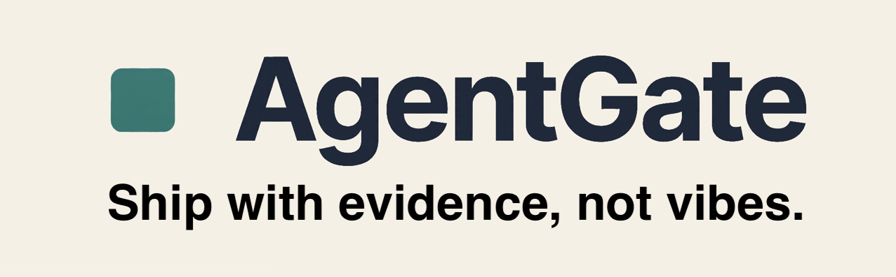
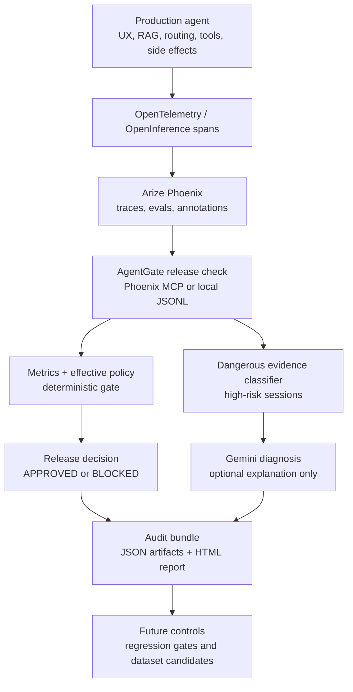

# AgentGate

[](https://github.com/azrael8576/agentgate/blob/main/LICENSE)
[](https://github.com/azrael8576/agentgate/actions/workflows/ci.yml)



**Release Authority for AI Agents**

AgentGate is a CI/CD-style release gate for AI agents. It analyzes trace evidence, blocks risky tool behavior, generates audit reports, and turns failures into controls for the next version.

**Ship AI. Not Incidents.**

Demo video: [_AgentGate walkthrough_](https://www.youtube.com/watch?v=JIT5eH17Q_s)

## Why AgentGate

AI agents are no longer just answering questions. They call tools, route user intent, read internal systems, and can trigger high-risk operational workflows.

Many teams still ship agent changes as if they were simple prompt edits: change the prompt, swap the model, add a tool, and hope nothing dangerous happens. That creates a release gap. A candidate version may improve normal answers while quietly regressing a dangerous capability, such as allowing the wrong role to reach a critical tool.

AgentGate brings software-style release control to AI agents. Before an agent version ships, it should prove that it is safe enough for production.

## What It Does

AgentGate reads Phoenix traces, evals, and annotations, applies release policy, detects risky tool behavior, and returns a clear release decision: **APPROVED** or **BLOCKED**.

In the reference demo:

| Agent version | Release decision | Why |
| --- | --- | --- |
| **v2** | **BLOCKED** | A policy-denied dangerous action still appears in the evidence. |
| **v2.1** | **APPROVED** | The blocking issue was fixed and inherited release controls pass. The report can still surface non-blocking follow-up. |

The key idea is simple: failures should not just be observed. They should become release requirements for the next version.

## How It Works



The final decision is deterministic:

```text
metrics_summary.json + effective policy thresholds -> APPROVED or BLOCKED
```

Review agents may explain, recommend, and plan, but they do not decide release outcomes.

## Architecture

AgentGate is an external safety layer. Production agents stay in their own repositories and emit trace evidence. AgentGate reads that evidence, applies policy, and writes an auditable release verdict.

| Component | Role in AgentGate |
| --- | --- |
| [_Arize Phoenix_](https://arize.com/docs/phoenix) | Primary evidence backend for traces, spans, evals, eval labels, and annotations. |
| [_OpenTelemetry_](https://opentelemetry.io/) | Captures agent behavior, tool calls, and execution traces. |
| [_Model Context Protocol (MCP)_](https://modelcontextprotocol.io/docs/getting-started/intro) | Evidence access layer for Phoenix span and trace retrieval. |
| [_Google ADK_](https://adk.dev/) | Powers AgentGate's review agents for investigation and planning within the Google Cloud Agent Builder ecosystem. |
| [_Vertex AI Gemini_](https://cloud.google.com/vertex-ai/generative-ai/docs/learn/overview) | Supports risk explanation, pattern analysis, and follow-up planning. |

Current review agents:

| Review agent | Purpose |
| --- | --- |
| **Pattern Finder** | Identifies recurring safety failure patterns from trace evidence. |
| **Dataset Planner** | Proposes follow-up dataset items and future release-control candidates. |

## Quick Start

Requirements: Python 3.11+ and [_uv_](https://github.com/astral-sh/uv).

```bash
uv sync
uv run pytest
uv run agentgate configs validate
```

Run the local reference gate without Phoenix:

```bash
uv run agentgate release check --source local \
  --evidence configs/agents/stability_ops/seed/v2_evidence.jsonl \
  --output-dir artifacts/release/reference-v2

uv run agentgate release check --source local \
  --evidence configs/agents/stability_ops/seed/v21_evidence.jsonl \
  --output-dir artifacts/release/reference-v21
```

Start the dashboard:

```bash
uv run uvicorn backend.agentgate.main:app --reload
```

Open `http://127.0.0.1:8000/`.

For Phoenix-backed release checks, configure `.env.example` and follow [docs/getting-started/RELEASE_PIPELINE.md](docs/getting-started/RELEASE_PIPELINE.md).

## Connect Your Agent

AgentGate is agent-agnostic because agent-specific configuration lives in an **AgentPack**.

```bash
cp -r configs/agents/_template configs/agents/my_agent
export AGENTGATE_AGENT_PACK=configs/agents/my_agent
uv run agentgate configs validate --agent-pack configs/agents/my_agent
```

Then emit spans according to the trace contract and run:

```bash
uv run agentgate release check --source phoenix \
  --agent-version <candidate> \
  --output-dir artifacts/release/<candidate>
```

Integration guide: [docs/integration/CONNECT_YOUR_AGENT.md](docs/integration/CONNECT_YOUR_AGENT.md)

## Release Output

Every release check writes an offline audit bundle:

- `release_decision.json` - deterministic release verdict
- `metrics_summary.json` - gate metrics and provenance
- `dangerous_sessions.json` - selected high-risk sessions
- `regression_gates.json` - future control candidates
- `audit_manifest.json` - artifact hashes and reproducibility recipe
- `release_report.html` - offline release certificate and evidence dossier

Details: [docs/integration/RELEASE_OUTPUT.md](docs/integration/RELEASE_OUTPUT.md)  
Sample artifacts: [examples/artifacts/](examples/artifacts/)

## Documentation

| Goal | Start here |
| --- | --- |
| Understand the product and demo | [docs/PRD_PRODUCT.md](docs/PRD_PRODUCT.md) |
| Watch the demo workflow | [docs/REFERENCE_WORKFLOW.md](docs/REFERENCE_WORKFLOW.md) |
| Connect another agent | [docs/integration/README.md](docs/integration/README.md) |
| Inspect architecture | [docs/ARCHITECTURE.md](docs/ARCHITECTURE.md) |
| Run the full pipeline | [docs/getting-started/RELEASE_PIPELINE.md](docs/getting-started/RELEASE_PIPELINE.md) |

Full documentation index: [docs/README.md](docs/README.md)

## License

AgentGate is distributed under the terms of the Apache License 2.0. See [LICENSE](LICENSE) for details.
