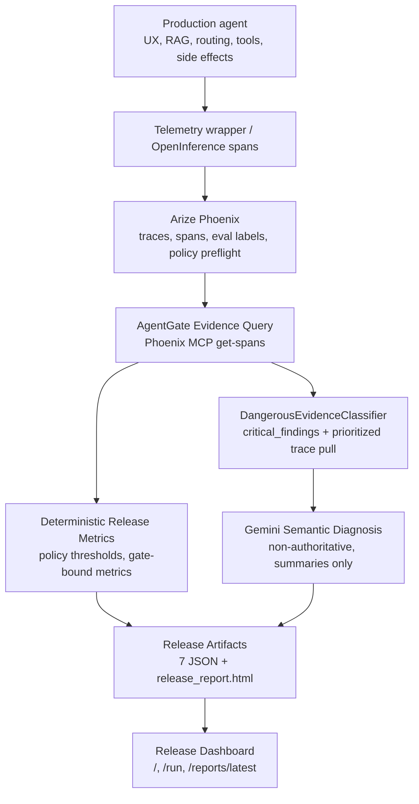

# AgentGate Architecture

> **Product:** [`PRD_PRODUCT.md`](./PRD_PRODUCT.md) · **Extended spec:** [`PRD.md`](./PRD.md) §3 Feature Status Matrix  
> **Integrate an agent:** [`integration/README.md`](./integration/README.md)

AgentGate is an external release safety gate targeting **dangerous capability regression** — a candidate version improves coverage while silently allowing the wrong role or route to trigger a high-risk tool.

Layer boundaries and product rules: [`PRD_PRODUCT.md`](./PRD_PRODUCT.md) §5 and §8. Domain terms: [`CONTEXT.md`](../CONTEXT.md).

## System Shape



## Layer Responsibilities

| Layer | Owns | Does not own |
| --- | --- | --- |
| Production agent | UX, RAG, routing, tools, side effects | Release authority |
| Phoenix | Traces, spans, sessions, eval labels, tool calls | Organization release policy |
| AgentGate | Metrics, dangerous session selection, deterministic decision, audit bundle, report | Trace DB, production runtime |

- Metrics Aggregator computes release metrics from span evidence. BLOCKED/APPROVE must be reproducible from saved artifacts without re-running Gemini.
- DangerousEvidenceClassifier selects `critical_findings`, prioritizes trace IDs, and drives capped `get-trace` pulls.
- Gemini consumes structured summaries only; it does not decide permissions.
- HTML Report: server-rendered `/reports/latest` + offline `release_report.html` (Certificate + Dossier).

## Repository Boundary

This repository may contain AgentPacks (`configs/agents/`), Phoenix base config, seed JSONL, and release pipeline code.

This repository must not contain a reimplementation of any production agent (chat bot, RAG, target-agent tools, fake answer engine). Production agent repos stay external (ADR-0005).

```text
agentgate/
├── backend/agentgate/
│   ├── core/           # agent_pack, ReleaseCheckConfig
│   ├── release/        # evidence pipeline, metrics, decision engine
│   ├── web/            # dashboard + report rendering
│   └── demo/           # seed / demo_cases only
├── configs/
│   ├── phoenix/        # shared base
│   └── agents/
│       ├── _template/
│       └── stability_ops/   # DefaultDemoPack
└── docs/
    ├── integration/    # connect your agent
    └── integrations/stability_ops/  # reference demo only
```

## Reference Integration

The first validated reference integration is **Reference Ops AI**. Materials: [`integrations/stability_ops/`](./integrations/stability_ops/). Demo script: [`REFERENCE_WORKFLOW.md`](./REFERENCE_WORKFLOW.md).

## Current Components

- FastAPI service with `/health`, dashboard routes, release-check API
- Typer CLI: `configs`, `demo`, `release`, `telemetry`, `eval`
- Pydantic v2 schemas for agent profile, eval suite, release artifacts
- Phoenix MCP client, evidence normalization, metrics aggregation, decision engine
- DangerousEvidenceClassifier, Gemini diagnosis (optional), ADK wrapper
- Jinja2 report templates + standalone HTML export
- Agent profile + eval suite contract validation; audit manifest with SHA-256

The `demo` CLI namespace is local fixture naming for seeded reference evidence.

## Documentation

See [`README.md`](./README.md) for reading paths (demo, integration, maintainers).
